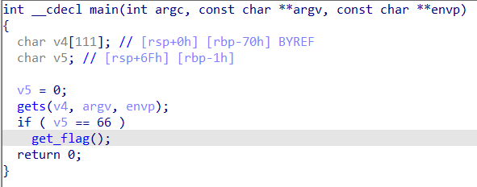
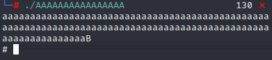
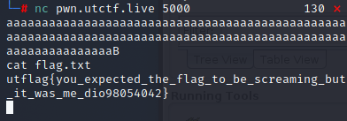

# UTCTF 2022
## AAAAAAAAAAAAAAAA

> AAAAAAAAAAAAAAAAAAAAAAAAAAAAAAAAAAAAAAAAAAAAAAAAAAAAAAAAAAAAAAAAAAAAAAAAAAAAAAAAAAAAAAAAAAAA
>
> By Tristan (@trab on discord)
>
> [AAAAAAAAAAAAAAAA](AAAAAAAAAAAAAAAA)

Category: *Beginner*

## Summary

Use buffer overflow to access the shell and get the flag.

## Detailed Solution

To start, let's decompile the provided program using IDA (F5 is decompilation hotkey).

This is a buffer overflow from the vulnerable `gets()` function. If we can overflow the `v4` buffer (>111 chars) and modify `v5` to be a char of value 66 ('B'), we can access the `get_flag()` function.

Connecting to the server with the provided command, we input 111 chars followed by a 'B', but no output is given! We get an empty line instead, and sending more input doesn't give any output back.

Let's test this locally with the provided program.

Based on the '#', it looks like we are actually given a shell! (You can test this by running a command like `ls`). Knowing this, let's go back to the server and run `cat flag.txt`.

